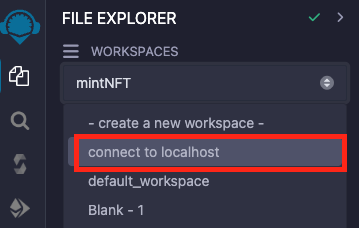
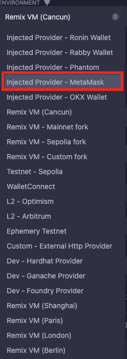

# ethers

> https://docs.ethers.org/v6/

# template clone

> git clone https://github.com/h662/vite-tailwind-template.git .

## 240522

> npm install ethers

- window.ehtereum?

```javascript
const App = () => {
  const onClickMetamask = async () => {
    try {
      console.log(window.ethereum);
    } catch (error) {
      console.error(error);
    }
  };

  return (
    <div className="bg-red-100 min-h-screen flex justify-center items-center">
      <button onClick={onClickMetamask}>🦊 메타마스크 로그인</button>
    </div>
  );
};

export default App;
```

브라우저에 Metamask 지갑이 설치되어 있다면, Proxy(Object) 콘솔 값을 확인 할 수 있습니다.  
만약 설치되어 있지 않다면(스크릿 모드) undefined 값을 확인 할 수 있습니다.

```javascript
import { ethers } from "ethers";

const App = () => {
  const onClickMetamask = async () => {
    try {
      if (!window.ethereum) return;

      const provider = new ethers.BrowserProvider(window.ethereum);

      console.log(provider);

      const signer = await provider.getSigner();

      console.log(signer);
    } catch (error) {
      console.error(error);
    }
  };

  return (
    <div className="bg-red-100 min-h-screen flex justify-center items-center">
      <button onClick={onClickMetamask}>🦊 메타마스크 로그인</button>
    </div>
  );
};

export default App;
```

ethers 임포트 후 onClickMetamask를 클릭하면 메타마스크 연결 창이 팝업됩니다.

연결 후 signer를 확인해보면, 아래와 같이 연결된 지갑 주소(address)를 확인 할 수 있습니다.

```javascript
JsonRpcSigner {provider: BrowserProvider, address: '연결된 지갑 주소'}
address : "연결된 지갑 주소"
provider : BrowserProvider {}
[[Prototype]] :  AbstractSigner
```

- button styling

간단하게 버튼/hover 스타일링해봅시다!

```css
/* index.css */
@tailwind base;
@tailwind components;
@tailwind utilities;

@layer components {
  .button-style {
    @apply border-4 border-green-300 rounded-full bg-white text-xl px-6 py-3 font-semibold hover:bg-gray-100 hover:border-green-400;
  }
}
```

```javascript
// App.jsx

import { ethers } from "ethers";
import { useState } from "react";

const App = () => {
  const [signer, setSigner] = useState();

  const onClickMetamask = async () => {
    try {
      if (!window.ethereum) return;

      const provider = new ethers.BrowserProvider(window.ethereum);

      console.log(provider);

      setSigner(await provider.getSigner());

      console.log(signer);
    } catch (error) {
      console.error(error);
    }
  };

  return (
    <div className="bg-red-100 min-h-screen flex justify-center items-center">
      {signer ? (
        <div>{signer.address}</div>
      ) : (
        <button className="button-style" onClick={onClickMetamask}>
          🦊 메타마스크 로그인
        </button>
      )}
    </div>
  );
};

export default App;
```

signer의 값 중 address를 useState 사용해서 표현해봅시다.

signer가 있다면 signer.address(지갑주소)가 나타나고 없으면 메타마스크 로그인 버튼이 표현됩니다.

adress를 감싸고 있는 `<div>`태그도 스타일링 해봅시다.

```css
/* index.css */
@tailwind base;
@tailwind components;
@tailwind utilities;

@layer components {
  .button-style {
    @apply border-4 border-green-300 rounded-full bg-white text-xl px-6 py-3 font-semibold hover:bg-gray-100 hover:border-green-400;
  }

  .box-style {
    @apply bg-white rounded-xl text-xl font-semibold py-3 px-6;
  }
}
```

주소도 substring을 적용해봅시다.

```javascript
// App.jsx

import { ethers } from "ethers";
import { useState } from "react";

const App = () => {
  const [signer, setSigner] = useState();

  const onClickMetamask = async () => {
    try {
      if (!window.ethereum) return;

      const provider = new ethers.BrowserProvider(window.ethereum);

      setSigner(await provider.getSigner());
    } catch (error) {
      console.error(error);
    }
  };

  return (
    <div className="bg-red-100 min-h-screen flex justify-center items-center">
      {signer ? (
        <div className="box-style">
          안녕하세요, {signer.address.substring(0, 5)}...
          {signer.address.substring(signer.address.length - 5)}
        </div>
      ) : (
        <button className="button-style" onClick={onClickMetamask}>
          🦊 메타마스크 로그인
        </button>
      )}
    </div>
  );
};

export default App;
```

이제 로그아웃 버튼을 만들어봅시다!

```javascript
// App.jsx

import { ethers } from "ethers";
import { useState } from "react";

const App = () => {
  const [signer, setSigner] = useState();

  const onClickMetamask = async () => {
    try {
      if (!window.ethereum) return;

      const provider = new ethers.BrowserProvider(window.ethereum);

      setSigner(await provider.getSigner());
    } catch (error) {
      console.error(error);
    }
  };

  const onClickLogOut = () => {};

  return (
    <div className="bg-red-100 min-h-screen flex justify-center items-center">
      {signer ? (
        <div className="flex gap-8">
          <div className="box-style">
            안녕하세요, {signer.address.substring(0, 7)}...
            {signer.address.substring(signer.address.length - 5)}님
          </div>
          <button
            className="button-style border-red-300 hover:border-red-400"
            onClick={onClickLogOut}
          >
            로그아웃
          </button>
        </div>
      ) : (
        <button className="button-style" onClick={onClickMetamask}>
          🦊 메타마스크 로그인
        </button>
      )}
    </div>
  );
};

export default App;
```

그럼 이제 onClickLogOut을 구현해봅시다.

```javascript
// App.jsx

import { ethers } from "ethers";
import { useState } from "react";

const App = () => {
  const [signer, setSigner] = useState();

  const onClickMetamask = async () => {
    try {
      if (!window.ethereum) return;

      const provider = new ethers.BrowserProvider(window.ethereum);

      setSigner(await provider.getSigner());
    } catch (error) {
      console.error(error);
    }
  };

  const onClickLogOut = () => {
    setSigner(null);
  };

  return (
    <div className="bg-red-100 min-h-screen flex justify-center items-center">
      {signer ? (
        <div className="flex gap-8">
          <div className="box-style">
            안녕하세요, {signer.address.substring(0, 7)}...
            {signer.address.substring(signer.address.length - 5)}님
          </div>
          <button
            className="button-style border-red-300 hover:border-red-400"
            onClick={onClickLogOut}
          >
            로그아웃
          </button>
        </div>
      ) : (
        <button className="button-style" onClick={onClickMetamask}>
          🦊 메타마스크 로그인
        </button>
      )}
    </div>
  );
};

export default App;
```

위 처럼 setSigner(null) 값을 주면 로그아웃 되는 것 처럼 보이지만, 메타마스크에서 직접 연결 해제하는 것과는 다르게 작동합니다.

### contracts

예제로 사용 할 스마트 컨트랙트를 만들어 봅시다.

위 순서대로 git clone을 하셨다면, 폴더 구조를 아래와 같이 변경해주세요.

FIRST-DAPP
-- contracts
-- vite (메타마스크 로그인 코드를 옮겨주세요)

### remix 연결하기

> remixd -s . --remix-ide https://remix.ethereum.org

> https://remix.ethereum.org/ 접속해서 connect to localhost를 해주세요.



contracts폴더에 MintToken.sol 파일을 생성해주세요.

```solidity
// MintToken.sol

// SPDX-License-Identifier: MIT
pragma solidity ^0.8.20;

import { ERC20 } from "@openzeppelin/contracts/token/ERC20/ERC20.sol";

contract MintToken is ERC20 {
    constructor(uint256 _initEther, string memory _name, string memory _symbol) ERC20(_name, _symbol) {
        _mint(msg.sender, _initEther * 10 ** 18);
    }
}
```

위 코드를 배포해 봅시다!

배포하려면 metamask 지갑을 로그인해야 합니다.



지갑 연결 후, CONTRACT 항목에 MintToken 파일이 잘 선택되었는지 확인하고 배포(DEPLOY)합니다.

배포 할 때, MintToken.sol 코드를 보면 constructor가 있습니다.

constructor는 스마트 컨트랙트가 배포 될 때, 최초 1번만 실행합니다.

\_initEther, \_name, \_symbol 값을 입력 후 deploy 하시면 배포됩니다!

## 240523

### Git

현재 폴더 구조는 아래와 같습니다.

ethers(FIRST-DAPP)
-- contracts
-- vite

vite폴더는 git clone을 했기 때문에, 깃을 제거해줍니다. git remote remove origin 명령어가 아닌, 깃을 삭제해줍니다.

> rm -rf .git

깃 삭제 후 상위 폴더 ethers(FIRST-DAPP)으로 이동 후 아래와 같이 명령어를 실행합니다.

상위폴더로 이동 명령어

> cd ..

하위폴더로 이동 명령어

> cd 폴더명

깃 시작

> git init

git init명령어를 시작 후 .gitignore에 아래 폴더들을 추가로 작성해줍니다.

```javascript
.env
.deps
artifacts
```

<!-- 각 폴더명 의미 써주기 -->

이제 깃에 업로드해줍니다.

커맨드 명령어는 아래와 같습니다.

> git add .
> git commit -m "first commit"
> git branch -M main
> git remote add origin 연결할 깃 레포주소
> git push -u origin main
