# ethers

> https://docs.ethers.org/v6/

# template clone

> git clone https://github.com/h662/vite-tailwind-template.git .

## 240522

> npm install ethers

- window.ehtereum?

```javascript
const App = () => {
  const onClickMetamask = async () => {
    try {
      console.log(window.ethereum);
    } catch (error) {
      console.error(error);
    }
  };

  return (
    <div className="bg-red-100 min-h-screen flex justify-center items-center">
      <button onClick={onClickMetamask}>🦊 메타마스크 로그인</button>
    </div>
  );
};

export default App;
```

브라우저에 Metamask 지갑이 설치되어 있다면, Proxy(Object) 콘솔 값을 확인 할 수 있습니다.  
만약 설치되어 있지 않다면(스크릿 모드) undefined 값을 확인 할 수 있습니다.

```javascript
import { ethers } from "ethers";

const App = () => {
  const onClickMetamask = async () => {
    try {
      if (!window.ethereum) return;

      const provider = new ethers.BrowserProvider(window.ethereum);

      console.log(provider);

      const signer = await provider.getSigner();

      console.log(signer);
    } catch (error) {
      console.error(error);
    }
  };

  return (
    <div className="bg-red-100 min-h-screen flex justify-center items-center">
      <button onClick={onClickMetamask}>🦊 메타마스크 로그인</button>
    </div>
  );
};

export default App;
```

ethers 임포트 후 onClickMetamask를 클릭하면 메타마스크 연결 창이 팝업됩니다.

연결 후 signer를 확인해보면, 아래와 같이 연결된 지갑 주소(address)를 확인 할 수 있습니다.

```javascript
JsonRpcSigner {provider: BrowserProvider, address: '연결된 지갑 주소'}
address : "연결된 지갑 주소"
provider : BrowserProvider {}
[[Prototype]] :  AbstractSigner
```

- button styling

간단하게 버튼/hover 스타일링해봅시다!

```css
/* index.css */
@tailwind base;
@tailwind components;
@tailwind utilities;

@layer components {
  .button-style {
    @apply border-4 border-green-300 rounded-full bg-white text-xl px-6 py-3 font-semibold hover:bg-gray-100 hover:border-green-400;
  }
}
```

```javascript
// App.jsx

import { ethers } from "ethers";
import { useState } from "react";

const App = () => {
  const [signer, setSigner] = useState();

  const onClickMetamask = async () => {
    try {
      if (!window.ethereum) return;

      const provider = new ethers.BrowserProvider(window.ethereum);

      console.log(provider);

      setSigner(await provider.getSigner());

      console.log(signer);
    } catch (error) {
      console.error(error);
    }
  };

  return (
    <div className="bg-red-100 min-h-screen flex justify-center items-center">
      {signer ? (
        <div>{signer.address}</div>
      ) : (
        <button className="button-style" onClick={onClickMetamask}>
          🦊 메타마스크 로그인
        </button>
      )}
    </div>
  );
};

export default App;
```

signer의 값 중 address를 useState 사용해서 표현해봅시다.

signer가 있다면 signer.address(지갑주소)가 나타나고 없으면 메타마스크 로그인 버튼이 표현됩니다.

adress를 감싸고 있는 `<div>`태그도 스타일링 해봅시다.

```css
/* index.css */
@tailwind base;
@tailwind components;
@tailwind utilities;

@layer components {
  .button-style {
    @apply border-4 border-green-300 rounded-full bg-white text-xl px-6 py-3 font-semibold hover:bg-gray-100 hover:border-green-400;
  }

  .box-style {
    @apply bg-white rounded-xl text-xl font-semibold py-3 px-6;
  }
}
```

주소도 substring을 적용해봅시다.

```javascript
// App.jsx

import { ethers } from "ethers";
import { useState } from "react";

const App = () => {
  const [signer, setSigner] = useState();

  const onClickMetamask = async () => {
    try {
      if (!window.ethereum) return;

      const provider = new ethers.BrowserProvider(window.ethereum);

      setSigner(await provider.getSigner());
    } catch (error) {
      console.error(error);
    }
  };

  return (
    <div className="bg-red-100 min-h-screen flex justify-center items-center">
      {signer ? (
        <div className="box-style">
          안녕하세요, {signer.address.substring(0, 5)}...
          {signer.address.substring(signer.address.length - 5)}
        </div>
      ) : (
        <button className="button-style" onClick={onClickMetamask}>
          🦊 메타마스크 로그인
        </button>
      )}
    </div>
  );
};

export default App;
```

이제 로그아웃 버튼을 만들어봅시다!

```javascript
// App.jsx

import { ethers } from "ethers";
import { useState } from "react";

const App = () => {
  const [signer, setSigner] = useState();

  const onClickMetamask = async () => {
    try {
      if (!window.ethereum) return;

      const provider = new ethers.BrowserProvider(window.ethereum);

      setSigner(await provider.getSigner());
    } catch (error) {
      console.error(error);
    }
  };

  const onClickLogOut = () => {};

  return (
    <div className="bg-red-100 min-h-screen flex justify-center items-center">
      {signer ? (
        <div className="flex gap-8">
          <div className="box-style">
            안녕하세요, {signer.address.substring(0, 7)}...
            {signer.address.substring(signer.address.length - 5)}님
          </div>
          <button
            className="button-style border-red-300 hover:border-red-400"
            onClick={onClickLogOut}
          >
            로그아웃
          </button>
        </div>
      ) : (
        <button className="button-style" onClick={onClickMetamask}>
          🦊 메타마스크 로그인
        </button>
      )}
    </div>
  );
};

export default App;
```

그럼 이제 onClickLogOut을 구현해봅시다.

```javascript
// App.jsx

import { ethers } from "ethers";
import { useState } from "react";

const App = () => {
  const [signer, setSigner] = useState();

  const onClickMetamask = async () => {
    try {
      if (!window.ethereum) return;

      const provider = new ethers.BrowserProvider(window.ethereum);

      setSigner(await provider.getSigner());
    } catch (error) {
      console.error(error);
    }
  };

  const onClickLogOut = () => {
    setSigner(null);
  };

  return (
    <div className="bg-red-100 min-h-screen flex justify-center items-center">
      {signer ? (
        <div className="flex gap-8">
          <div className="box-style">
            안녕하세요, {signer.address.substring(0, 7)}...
            {signer.address.substring(signer.address.length - 5)}님
          </div>
          <button
            className="button-style border-red-300 hover:border-red-400"
            onClick={onClickLogOut}
          >
            로그아웃
          </button>
        </div>
      ) : (
        <button className="button-style" onClick={onClickMetamask}>
          🦊 메타마스크 로그인
        </button>
      )}
    </div>
  );
};

export default App;
```

위 처럼 setSigner(null) 값을 주면 로그아웃 되는 것 처럼 보이지만, 메타마스크에서 직접 연결 해제하는 것과는 다르게 작동합니다.

### contracts

예제로 사용 할 스마트 컨트랙트를 만들어 봅시다.

위 순서대로 git clone을 하셨다면, 폴더 구조를 아래와 같이 변경해주세요.

FIRST-DAPP (최상위 폴더)

-- contracts

-- vite (위에 작성한 코드를 vite폴더로 이동해주세요)

### remix 연결하기

> remixd -s . --remix-ide https://remix.ethereum.org

> https://remix.ethereum.org/ 접속해서 connect to localhost를 해주세요.


contracts폴더에 MintToken.sol 파일을 생성해주세요.

```solidity
// MintToken.sol

// SPDX-License-Identifier: MIT
pragma solidity ^0.8.20;

import { ERC20 } from "@openzeppelin/contracts/token/ERC20/ERC20.sol";

contract MintToken is ERC20 {
    constructor(uint256 _initEther, string memory _name, string memory _symbol) ERC20(_name, _symbol) {
        _mint(msg.sender, _initEther * 10 ** 18);
    }
}
```

위 코드를 배포해 봅시다!

‼️ 배포 전 컴파일 부터 실행해야 합니다! Auto compile 체크가 안되어 있다면 아래 사진을 보시고 확인해주세요!

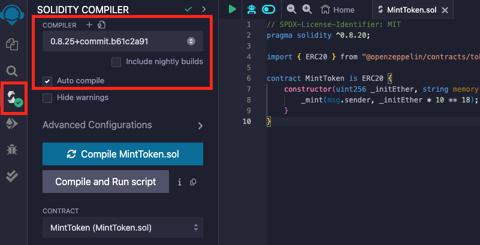

배포하려면 metamask 지갑을 로그인해야 합니다.


지갑 연결 후, CONTRACT 항목에 MintToken 파일이 잘 선택되었는지 확인하고 배포(DEPLOY)합니다.

배포 할 때, MintToken.sol 코드를 보면 constructor가 있습니다.

constructor는 스마트 컨트랙트가 배포 될 때, 최초 1번만 실행합니다.

\_initEther, \_name, \_symbol 값을 입력 후 deploy 하시면 배포됩니다!

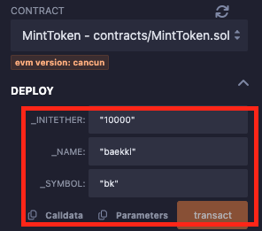

## 240523

### Git

현재 폴더 구조는 아래와 같습니다.

최상위 폴더

- ethers(FIRST-DAPP)

하위 폴더

- contracts
- vite

vite폴더는 git clone을 했기 때문에, 깃을 제거해줍니다. git remote remove origin 명령어가 아닌, 깃을 삭제해줍니다.

⚠️ vite 폴더 경로에서 아래 명령어를 순서대로 실행해주세요.

> rm -rf .git

깃 삭제 후 상위 폴더 ethers(FIRST-DAPP)으로 이동 후 아래와 같이 명령어를 실행합니다.

상위폴더로 이동 명령어

> cd ..

하위폴더로 이동 명령어

> cd 폴더명

깃 시작

> git init

git init명령어를 시작 후 .gitignore에 아래 폴더들을 추가로 작성해줍니다.

```javascript
.env
.deps
artifacts
```

각 폴더 및 폴더의 의미는 뭘까요?

- .env 파일은 환경 변수를 정의하고 관리하기 위한 파일입니다. 보통 루트 디렉토리에 위치합니다.

- .dpes 폴더는 "dependencies"의 약자로, 의존성 관련 파일들을 포함하고 있습니다. 폴더를 살펴보면 경로가 .dpes/npm/@openzeppelin/.. 으로 되어 있습니다. 한 가지 확인 할 수 있는 것은 MintToken.sol 코드 작성시 ERC20 을 import 했었죠? .deps/token/ERC20/extensions에 보면 ERC20.sol 파일도 볼 수 있습니다.

- artifacts 폴더는 MintToken.sol 파일의 컴파일 된 결과물들이 저장된 폴더입니다.

이제 깃에 업로드해줍니다.

커맨드 명령어는 아래의 순서와 같습니다.

> git add .  
> git commit -m "first commit"  
> git branch -M main  
> git remote add origin 연결할 깃 레포주소  
> git push -u origin main

### Vercel 배포하기

먼저 vercel에 배포해봅시다!

> https://vercel.com/

vercel에 접속하셔서 우측에 Add New - project를 선택합니다.

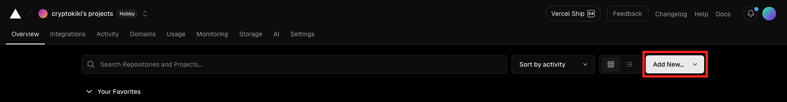

ethers폴더를 선택해 줍니다. (또는 FIRST-DAPP으로 실습하신 분은 FIRST-DAPP 폴더명을 선택)

근데 중요한 점은, 최상위 폴더 FIRST-DAPP에서 하위 폴더로 vite와 contracts가 있습니다.

contracts는 굳이 배포 할 필요가 없기 때문에, vite폴더만 선택해서 배포합니다.

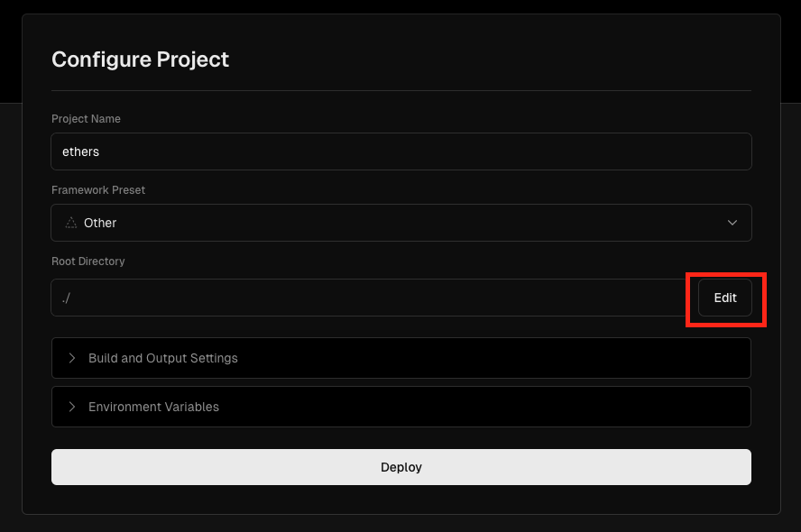

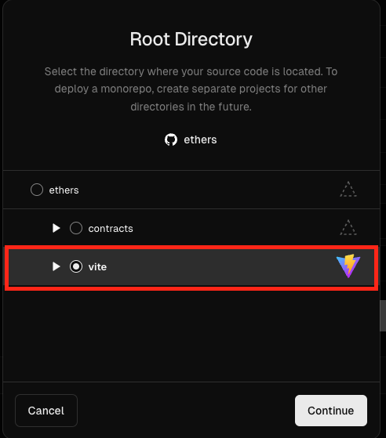

선택 후, 배포(Deploy)하면 vite폴더만 배포가 됩니다.

배포가 완료되었다면 주소로 접속해서 메타마스크 로그인 기능이 잘 작동되는지 확인해보세요!

### burn function

토큰을 소각시키는 함수(burnToken)를 만들어 봅시다.

참고 링크 : https://docs.openzeppelin.com/contracts/5.x/api/token/erc20#ERC20-_burn-address-uint256-

```solidity
// SPDX-License-Identifier: MIT
pragma solidity ^0.8.20;

import { ERC20 } from "@openzeppelin/contracts/token/ERC20/ERC20.sol";

contract MintToken is ERC20 {
    constructor(uint256 _initEther, string memory _name, string memory _symbol) ERC20(_name, _symbol) {
        _mint(msg.sender, _initEther * 10 ** 18);
    }

    function burnToken(uint256 _etherAmount) public {
        _burn(msg.sender, _etherAmount * 10 ** 18);
    }
}
```

먼저 burnToken함수를 보면, 실행부분에 \_burn이 있습니다. \_burn은 뭘까요?

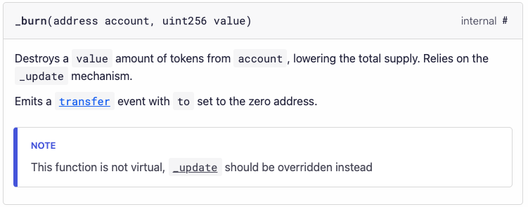

함수를 보시면, 인자로 address 형의 account, uint256형의 value 값을 필요로 합니다.

그런데 우리가 작성한 burnToken()에는 uint256 \_etherAmount(value)만 있고, address형인 account는 받지 않았습니다.

대신, msg.sender라는 예약어를 사용했죠. msg.sender는 함수를 실행시킨 주체입니다.

A가 해당 함수를 실행하면, A가 입력한 \_etherAmount 만큼 A의 토큰을 소각하는 함수입니다.

따라서 burnToken 함수에 인자값으로 account가 없어도 되는 이유입니다.

그럼 내가 다른사람의 토큰을 소각 할 수 있을까요? 아니면 누군가가 나의 토큰을 소각 할 수 있을까요? 확인해봅시다.

```solidity
// SPDX-License-Identifier: MIT
pragma solidity ^0.8.20;

import { ERC20 } from "@openzeppelin/contracts/token/ERC20/ERC20.sol";

contract MintToken is ERC20 {
    constructor(uint256 _initEther, string memory _name, string memory _symbol) ERC20(_name, _symbol) {
        _mint(msg.sender, _initEther * 10 ** 18);
    }

    function burnToken(uint256 _etherAmount) public {
        _burn(msg.sender, _etherAmount * 10 ** 18);
    }

    function burnSomeoneToken(address _account, uint _amount) public {
        _burn(_account, _amount * 10 ** 18);
    }
}
```

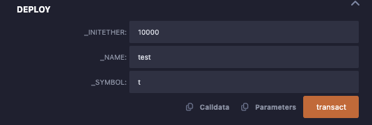

test라는 토큰을 10000개 발행했습니다.

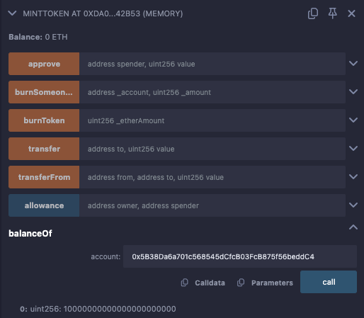

컨트랙트를 배포한 A계정(0x5B38Da6a701c568545dCfcB03FcB875f56beddC4)에 현재 10000 개의 토큰이 있습니다.

그럼 토큰이 없는 B계정(0xAb8483F64d9C6d1EcF9b849Ae677dD3315835cb2)이 A계정의 토큰 100개를 소각해봅시다.

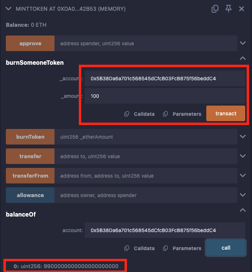

위 이미지를 보시면, B의 계정으로 A 토큰 100개가 소각 된 것을 확인 할 수 있습니다.

⚠️ 특정 함수는 관리자만 실행 할 수 있게 작성하는 것은 중요합니다! 컨트랙트가 배포 될 때 한 번만 실행되는 constructor에 관리자를 설정 할 수 있는 코드를 작성하는 것도 방법이겠죠? (이후에 visibility, modifier와 같이 배우실 겁니다🙂)

### 스마트 컨트랙트 총 발행량 가져오기

ethers docs : https://docs.ethers.org/v6/getting-started/#cid_54

위 ethers 공식문서를 보면,

```javascript
// Create a contract
contract = new Contract("dai.tokens.ethers.eth", abi, provider);
```

가 있습니다. 먼저 abi는 무엇일까요?

> ABI (Application Binary Interface)는 스마트 컨트랙트와 상호 작용하기 위해 사용되는 인터페이스를 정의합니다. Solidity 파일을 컴파일하면 ABI라는 파일이 생성되는데, 이 파일은 스마트 컨트랙트의 함수와 이벤트를 설명하는 JSON 형식의 데이터입니다.

그럼 ABI가 리액트와 연결하는데 왜 필요할까요?

- 함수 호출 및 트랜잭션 전송: React 애플리케이션에서 스마트 컨트랙트의 함수를 호출하거나 트랜잭션을 전송하려면 ABI를 사용해 어떤 함수가 어떤 형식의 인수를 요구하는지 알아야 합니다.

- 데이터 변환: 스마트 컨트랙트와 주고받는 데이터의 형식을 맞추기 위해 ABI를 사용하여 데이터를 적절히 인코딩/디코딩합니다.

- 이벤트 처리: 스마트 컨트랙트에서 발생하는 이벤트를 리스닝하고 처리하는 데 ABI 정보가 필요합니다.

그럼 Provider는 무엇일까요?

> Provider는 이더리움 네트워크에 연결하여 블록체인과 상호작용할 수 있게 해주는 역할을 합니다.

- 블록체인 데이터 접근: 블록체인의 상태, 트랜잭션, 블록 등의 데이터를 조회할 수 있습니다.

- 트랜잭션 전송: 이더리움 네트워크에 트랜잭션을 전송할 수 있습니다.

- 스마트 컨트랙트 호출: 스마트 컨트랙트의 함수를 호출하거나 실행할 수 있습니다.

종류로는, Infura, Alchemy 같은 서비스 제공업체에서 호스팅하는 hosted Provider가 있고

메타마스크와 같은 브라우저 확장 프로그램이 제공하는 provider와 연결하는 브라우저에 내장된 Provider 종류가 있습니다.

마지막으로, "dai.tokens.ethers.eth" 이 부분은 스마트 컨트랙트 주소가 들어갑니다.

그럼 ABI는 어디서 가져올까요?

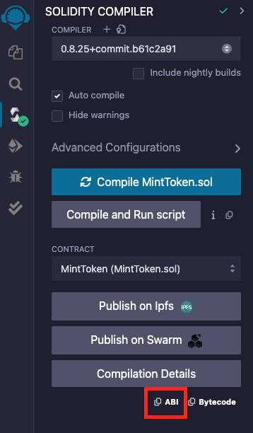

CONTRACT에 작성한 .sol파일이 맞는지 확인 하고 컴파일을 하시신 후 ABI를 복사하시면 됩니다.

vite/src 폴더 하위에 abi.json 파일을 생성 후, 복사한 abi코드를 복사 붙여넣기 해주세요!

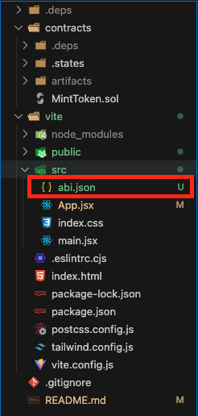

- solidity 코드가 완전히 동일하다면, abi는 동일합니다.

abi를 App.jsx에서 import합니다.

```javascript
// App.jsx

import { Contract, ethers } from "ethers";
import { useEffect, useState } from "react";

import abi from "./abi.json";

const App = () => {
  const [signer, setSigner] = useState();
  const [contract, setContract] = useState();

  const onClickMetamask = async () => {
    try {
      if (!window.ethereum) return;

      const provider = new ethers.BrowserProvider(window.ethereum);

      setSigner(await provider.getSigner());
    } catch (error) {
      console.error(error);
    }
  };

  const onClickLogOut = () => {
    setSigner(null);
  };

  useEffect(() => {
    if (!signer) return;

    setContract(new Contract("스마트 컨트랙트 주소", abi, signer));
  }, [signer]);

  useEffect(() => console.log(contract), [contract]);

  return (
    <div className="bg-red-100 min-h-screen flex justify-center items-center">
      {signer ? (
        <div className="flex gap-8">
          <div className="box-style">
            안녕하세요, {signer.address.substring(0, 7)}...
            {signer.address.substring(signer.address.length - 5)}님
          </div>
          <button
            className="button-style border-red-300 hover:border-red-400"
            onClick={onClickLogOut}
          >
            로그아웃
          </button>
        </div>
      ) : (
        <button className="button-style" onClick={onClickMetamask}>
          🦊 메타마스크 로그인
        </button>
      )}
    </div>
  );
};

export default App;
```

29번째 줄 "스마트 컨트랙트 주소"에는 배포하신 스마트 컨트랙트 주소를 넣으시면 됩니다.

코드를 실행하면, 아래와 같은 값을 확인 할 수 있습니다.


```javascript
// App.jsx

import { Contract, ethers } from "ethers";
import { useEffect, useState } from "react";
import abi from "./abi.json";

const App = () => {
  const [signer, setSigner] = useState();
  const [contract, setContract] = useState();

  const onClickMetamask = async () => {
    try {
      if (!window.ethereum) return;

      const provider = new ethers.BrowserProvider(window.ethereum);

      setSigner(await provider.getSigner());
    } catch (error) {
      console.error(error);
    }
  };

  const onClickLogOut = () => {
    setSigner(null);
  };

  useEffect(() => {
    if (!signer) return;

    setContract(
      new Contract("0xb341EC4B7b005799d0Ec2b54108b6CAe7EC5d625", abi, signer)
    );
  }, [signer]);

  useEffect(() => console.log(contract), [contract]);

  return (
    <div className="bg-red-100 min-h-screen flex flex-col justify-start items-center py-16">
      {signer ? (
        <div className="flex gap-8">
          <div className="box-style">
            안녕하세요, {signer.address.substring(0, 7)}...
            {signer.address.substring(signer.address.length - 5)}님
          </div>
          <button
            className="button-style border-red-300 hover:border-red-400"
            onClick={onClickLogOut}
          >
            로그아웃
          </button>
        </div>
      ) : (
        <button className="button-style" onClick={onClickMetamask}>
          🦊 메타마스크 로그인
        </button>
      )}
      {contract && (
        <div className="mt-16">
          <h1 className="box-style">스마트 컨트랙트 연결을 완료했습니다.</h1>
        </div>
      )}
    </div>
  );
};

export default App;
```

수정 할 사항은 로그아웃을 하더라도 "스마트컨트랙트 연결을 완료했습니다." 문구는 그대로 입니다.

onClickLogOut을 수정해봅시다.

```javascript
const onClickLogOut = () => {
  setSigner(null);
  setContract(null);
};
```

총 발행량을 확인 할 수 있도록 작성해봅시다.

```javascript
// App.jsx

import { Contract, ethers } from "ethers";
import { useEffect, useState } from "react";
import abi from "./abi.json";

const App = () => {
  const [signer, setSigner] = useState();
  const [contract, setContract] = useState();

  const onClickMetamask = async () => {
    try {
      if (!window.ethereum) return;

      const provider = new ethers.BrowserProvider(window.ethereum);

      setSigner(await provider.getSigner());
    } catch (error) {
      console.error(error);
    }
  };

  const onClickLogOut = () => {
    setSigner(null);
    setContract(null);
  };

  const onClickTotalSupply = async () => {
    try {
      const response = await contract.totalSupply();

      console.log(response);
    } catch (error) {
      console.error(error);
    }
  };

  useEffect(() => {
    if (!signer) return;

    setContract(
      new Contract("0xb341EC4B7b005799d0Ec2b54108b6CAe7EC5d625", abi, signer)
    );
  }, [signer]);

  useEffect(() => console.log(contract), [contract]);

  return (
    <div className="bg-red-100 min-h-screen flex flex-col justify-start items-center py-16">
      {signer ? (
        <div className="flex gap-8">
          <div className="box-style">
            안녕하세요, {signer.address.substring(0, 7)}...
            {signer.address.substring(signer.address.length - 5)}님
          </div>
          <button
            className="button-style border-red-300 hover:border-red-400"
            onClick={onClickLogOut}
          >
            로그아웃
          </button>
        </div>
      ) : (
        <button className="button-style" onClick={onClickMetamask}>
          🦊 메타마스크 로그인
        </button>
      )}
      {contract && (
        <div className="mt-16 flex flex-col gap-8">
          <h1 className="box-style">스마트 컨트랙트 연결을 완료했습니다.</h1>
          <div className="flex">
            <div className="box-style">총 발행량 확인</div>
            <button className="button-style" onClick={onClickTotalSupply}>
              확인
            </button>
          </div>
        </div>
      )}
    </div>
  );
};

export default App;
```

⚠️ 컨트랙트와 상호작용 할 때는 비동기 함수로 작성해야 한다고 생각하세요!

위 코드를 실행하면 아래와 같은 값을 확인 할 수 있습니다.


그런데 response 값 뒤에 n(bigint)가 붙어있습니다. bigint는 큰 숫자를 처리하는 데이터 타입입니다.

그리고 숫자 값이 매우 크죠? 위 response 값은 eth 단위가 아닌 wei 입니다.

> 참고 : 단위 편환 표

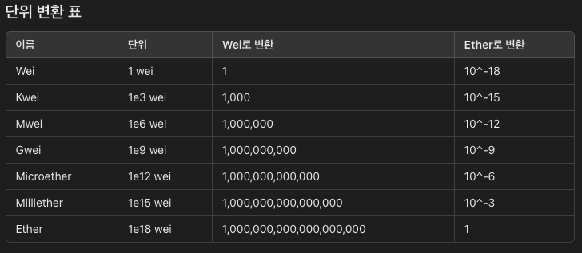

bigint 타입을 number타입으로 변환 후, "총 발행량 확인" 부분에 나타내주면 되겠죠?

단위를 변경하는 방법은 여러가지지만, ethers에서 제공해주는 formatEther()함수를 사용해봅시다!

스타일링도 일부 수정되었으니, 참고해주세요.

```javascript
// App.jsx

import { Contract, ethers, formatEther } from "ethers";
import { useEffect, useState } from "react";
import abi from "./abi.json";

const App = () => {
  const [signer, setSigner] = useState();
  const [contract, setContract] = useState();
  const [totalSupply, setTotalSupply] = useState();

  const onClickMetamask = async () => {
    try {
      if (!window.ethereum) return;

      const provider = new ethers.BrowserProvider(window.ethereum);

      setSigner(await provider.getSigner());
    } catch (error) {
      console.error(error);
    }
  };

  const onClickLogOut = () => {
    setSigner(null);
    setContract(null);
    setTotalSupply(null);
  };

  const onClickTotalSupply = async () => {
    try {
      const response = await contract.totalSupply();

      setTotalSupply(response);
    } catch (error) {
      console.error(error);
    }
  };

  useEffect(() => {
    if (!signer) return;

    setContract(
      new Contract("0xb341EC4B7b005799d0Ec2b54108b6CAe7EC5d625", abi, signer)
    );
  }, [signer]);

  useEffect(() => console.log(contract), [contract]);

  return (
    <div className="bg-red-100 min-h-screen flex flex-col justify-start items-center py-16">
      {signer ? (
        <div className="flex gap-8">
          <div className="box-style">
            안녕하세요, {signer.address.substring(0, 7)}...
            {signer.address.substring(signer.address.length - 5)}님
          </div>
          <button
            className="button-style border-red-300 hover:border-red-400"
            onClick={onClickLogOut}
          >
            로그아웃
          </button>
        </div>
      ) : (
        <button className="button-style" onClick={onClickMetamask}>
          🦊 메타마스크 로그인
        </button>
      )}
      {contract && (
        <div className="mt-16 flex flex-col gap-8 bg-blue-100 grow max-w-md w-full">
          <h1 className="box-style">스마트 컨트랙트 연결을 완료했습니다.</h1>
          <div className="flex">
            <div className="box-style grow">
              {totalSupply
                ? `총 발행량: ${formatEther(totalSupply)}ETH`
                : "총 발행량 확인"}
            </div>
            <button className="button-style ml-4" onClick={onClickTotalSupply}>
              확인
            </button>
          </div>
        </div>
      )}
    </div>
  );
};

export default App;
```

⚠️ wei ➡️ eth로 변환하려면, parseEther를 사용해주시면 됩니다.

```javascript
const weiToEth = formatEther(response);
console.log(weiToEth);

const ethToWei = parseEther(weiToEth, "wei");
console.log(ethToWei);
```

### 토큰 이름 가져오기

```javascript
// App.jsx

import { Contract, ethers, formatEther } from "ethers";
import { useEffect, useState } from "react";
import abi from "./abi.json";

const App = () => {
  const [signer, setSigner] = useState();
  const [contract, setContract] = useState();
  const [totalSupply, setTotalSupply] = useState();
  const [name, setName] = useState();

  const onClickMetamask = async () => {
    try {
      if (!window.ethereum) return;

      const provider = new ethers.BrowserProvider(window.ethereum);

      setSigner(await provider.getSigner());
    } catch (error) {
      console.error(error);
    }
  };

  const onClickLogOut = () => {
    setSigner(null);
    setContract(null);
    setTotalSupply(null);
    setName(null);
  };

  const onClickTotalSupply = async () => {
    try {
      const response = await contract.totalSupply();

      setTotalSupply(response);
    } catch (error) {
      console.error(error);
    }
  };

  const onClickName = async () => {
    try {
      const response = await contract.name();

      console.log(response);

      setName(response);
    } catch (error) {
      console.error(error);
    }
  };

  useEffect(() => {
    if (!signer) return;

    setContract(
      new Contract("0xb341EC4B7b005799d0Ec2b54108b6CAe7EC5d625", abi, signer)
    );
  }, [signer]);

  useEffect(() => console.log(contract), [contract]);

  return (
    <div className="bg-red-100 min-h-screen flex flex-col justify-start items-center py-16">
      {signer ? (
        <div className="flex gap-8">
          <div className="box-style">
            안녕하세요, {signer.address.substring(0, 7)}...
            {signer.address.substring(signer.address.length - 5)}님
          </div>
          <button
            className="button-style border-red-300 hover:border-red-400"
            onClick={onClickLogOut}
          >
            로그아웃
          </button>
        </div>
      ) : (
        <button className="button-style" onClick={onClickMetamask}>
          🦊 메타마스크 로그인
        </button>
      )}
      {contract && (
        <div className="mt-16 flex flex-col gap-8 bg-blue-100 grow max-w-md w-full">
          <h1 className="box-style">스마트 컨트랙트 연결을 완료했습니다.</h1>
          <div className="flex flex-col gap-8">
            <div className="flex w-full">
              <div className="box-style grow">
                {totalSupply
                  ? `총 발행량: ${formatEther(totalSupply)}ETH`
                  : "총 발행량 확인"}
              </div>
              <button
                className="button-style ml-4"
                onClick={onClickTotalSupply}
              >
                확인
              </button>
            </div>
            <div className="flex w-full">
              <div className="box-style grow">
                {name ? `토큰 이름: ${name}` : "토큰 이름 확인"}
              </div>
              <button className="button-style ml-4" onClick={onClickName}>
                확인
              </button>
            </div>
          </div>
        </div>
      )}
    </div>
  );
};

export default App;
```

totalSupply가져오는 것 처럼 contract.name()을 이용해서 토큰 이름을 가져왔습니다.

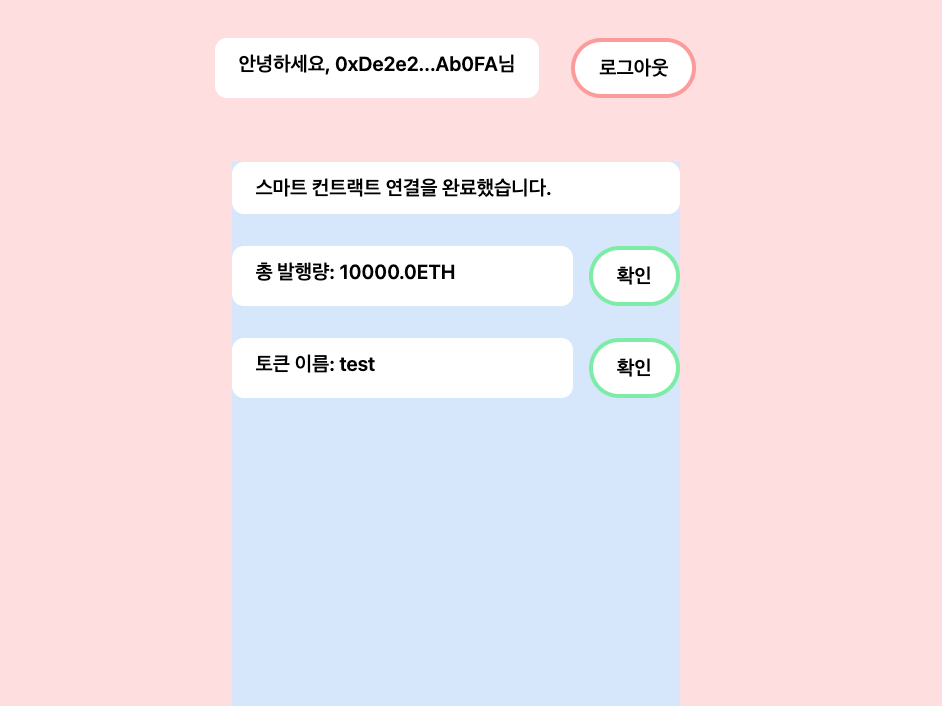
